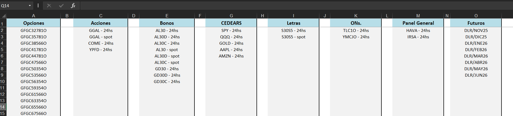
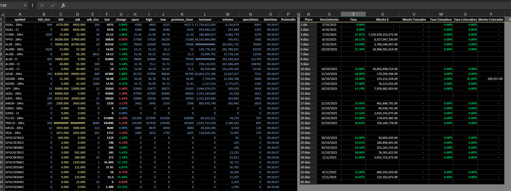
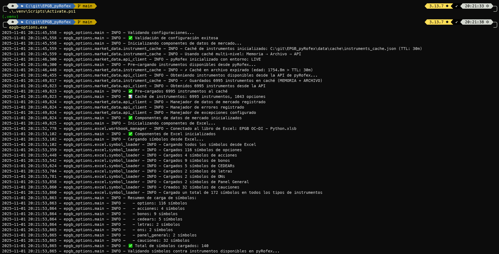
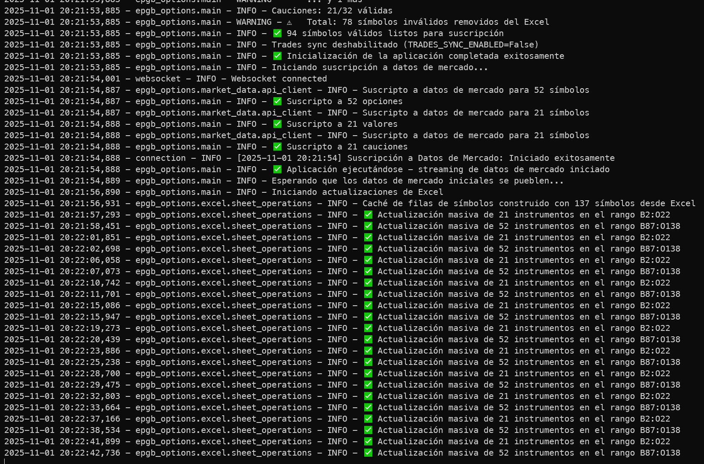

# EPGB_pyRofex - Datos de Mercado en Tiempo Real

Aplicación Python para obtener datos de mercado en tiempo real y gestionar opciones desde tu planilla de Excel. 

Es una aplicación análoga a [EPGB_HomeBroker](https://github.com/juanmarti81/EPGB_HomeBroker) utilizando la librería de [pyRofex](https://github.com/matbarofex/pyRofex).

## 📊 ¿Qué hace esta aplicación?

EPGB_pyRofex te permite:

- Obtener datos de mercado en tiempo real de opciones usando la API de Primary (Matriz) [https://apihub.primary.com.ar](https://apihub.primary.com.ar/#apis)
- Integración directa con Excel para visualizar y analizar los datos
- Actualización automática de precios, volúmenes y otros datos de mercado
- Gestión de instrumentos de opciones, acciones, bonos, ONs desde tu planilla de Excel

## 🚀 Inicio Rápido

### Requisitos previos

- Python 3.9 o superior
- Microsoft Excel (para la integración con xlwings)
- Windows (recomendado para la integración con Excel)

### Instalación

#### Opción 1: Instalación moderna (recomendada)

```bash
# Clonar el repositorio
git clone https://github.com/ChuchoCoder/EPGB_pyRofex.git
cd EPGB_pyRofex

# Crear y activar un entorno virtual (Windows)
python -m venv .venv
.venv\Scripts\activate

# Instalar el paquete en modo editable
pip install -e . --force-reinstall --no-deps
```

#### Opción 2: Instalación manual

```bash
# Crear entorno virtual
python -m venv .venv

# Activar entorno virtual (Windows)
.venv\Scripts\activate

# Instalar dependencias
pip install -r requirements.txt
```

### Configuración

1. Copiá la plantilla y creá el archivo de configuración:

```bash
copy .env.example .env
```

2. Editá el archivo `.env` con tus credenciales:

```env
PYROFEX_USER=tu_usuario
PYROFEX_PASSWORD=tu_contraseña
PYROFEX_ACCOUNT=tu_cuenta

# Opcional: Configura el intervalo de actualización de Excel (en segundos, por defecto: 3.0)
EXCEL_UPDATE_INTERVAL=3.0

# Trades Sheet Configuration (opcional)
TRADES_SYNC_ENABLED=true                # Habilitar sincronización de trades (por defecto: true)
TRADES_REALTIME_ENABLED=false           # Habilitar actualizaciones en tiempo real vía WebSocket (por defecto: false)
TRADES_SYNC_INTERVAL_SECONDS=300        # Intervalo de sincronización periódica en segundos (por defecto: 300 = 5 min)
EXCEL_SHEET_TRADES=Trades               # Nombre de la hoja de trades (por defecto: Trades)
TRADES_BATCH_SIZE=500                   # Tamaño de lote para procesamiento masivo (por defecto: 500)
```

> **Importante:** Nunca compartas ni subas tu archivo `.env` con credenciales reales.

#### Configuración de Trades

La aplicación puede sincronizar operaciones ejecutadas (trades) desde el broker a una hoja de Excel dedicada. Hay dos modos de operación:

- **Modo Periódico (por defecto)**: `TRADES_REALTIME_ENABLED=false`
  - Sincroniza trades cada `TRADES_SYNC_INTERVAL_SECONDS` segundos (por defecto: 300s = 5 min)
  - Usa llamadas REST a la API del broker
  - Menor carga en tiempo real, pero mayor latencia
  
- **Modo Tiempo Real**: `TRADES_REALTIME_ENABLED=true`
  - Sincroniza trades inmediatamente vía WebSocket cuando ocurren
  - Actualización instantánea de operaciones ejecutadas
  - Mayor carga en tiempo de ejecución, pero latencia mínima

Para deshabilitar completamente la sincronización de trades, configurá: `TRADES_SYNC_ENABLED=false`

3. (Opcional) Generá módulos de configuración faltantes:

```bash
python tools/create_configs.py
```

### Configuración de Instrumentos en Excel

La hoja `Tickers` del archivo **EPGB OC-DI - Python.xlsb** define qué instrumentos se van a suscribir. Cada tipo de instrumento tiene una columna fija.

| Tipo | Columna | Rango usado | Ejemplo en celda | Transformación hacia pyRofex |
|------|---------|-------------|------------------|-------------------------------|
| Opciones | A | A2:A500 | GFGC32781O | Se agrega prefijo `MERV - XMEV -` y sufijo ` - 24hs` (ya incluido si figura en la plantilla) |
| Acciones | C | C2:C500 | GGAL - 24hs / GGAL - spot | Prefijo + sufijo (24hs o spot). Spot se detecta al tener literal `spot` en el nombre |
| Bonos | E | E2:E500 | AL30 - 24hs / AL30D - spot | Prefijo + sufijo; sufijo ` - 24hs` o ` - spot` según la celda |
| CEDEARs | G | G2:G500 | AAPL - 24hs | Prefijo + sufijo |
| Letras | I | I2:I500 | S30S5 - 24hs | Prefijo + sufijo |
| ONs | K | K2:K500 | TLC1O - 24hs | Prefijo + sufijo |
| Panel General | M | M2:M500 | HAVA - 24hs | Prefijo + sufijo |
| Futuros | O | O2:O500 | DLR/NOV25 | SIN prefijo ni sufijo (detectado por `/`) |

> Los símbolos se transforman mediante la función interna `transform_symbol_for_pyrofex`. Si el símbolo contiene `/` (caso futuros como `DLR/NOV25`) no se aplica el prefijo `MERV - XMEV -` ni el sufijo ` - 24hs`.

#### Opciones
- Deben colocarse en la columna A.
- Formato típico: Código raíz + cadena de vencimiento + `O` (ej: `GFGC32781O`).
- La aplicación genera un DataFrame con columnas: `bid`, `ask`, `bidsize`, `asksize`, `last`, `change`, `open`, `high`, `low`, `previous_close`, `turnover`, `volume`, `operations`, `datetime`.

#### Spot vs 24hs
Para acciones/bonos/etc. se distinguen dos variantes:
- `AL30 - 24hs` (24 horas)
- `AL30 - spot` (contado inmediatamente)

Ambas variantes pueden convivir. El sufijo exacto determina la transformación y suscripción.

#### Futuros
- Se ingresan en la columna O sin sufijos: `DLR/NOV25`, `DLR/DIC25`, `DLR/ENE26`.
- La detección de futuro es por el caracter `/`.
- No se agrega prefijo ni sufijo para asegurar compatibilidad con la API.

#### Cauciones (Repos)
No se configuran manualmente en el Excel: se generan automáticamente de 1D a 32D bajo el formato:
```
MERV - XMEV - PESOS - 1D
...
MERV - XMEV - PESOS - 32D
```
Se muestran en la tabla derecha de la hoja `Prices`.

#### Validación de Instrumentos
Al iniciar, la app:
1. Lee cada columna y filtra celdas vacías.
2. Aplica transformación de símbolos.
3. Consulta el caché de instrumentos de pyRofex.
4. Remueve los símbolos inválidos (log: `⚠️  Total: X símbolos inválidos removidos`).
5. Muestra resumen por tipo (ej: `Opciones: 52/60 válidas`).

#### Ejemplo Visual
Hoja `Tickers` (configuración de símbolos):


Hoja `Prices` (datos de mercado y cauciones):


Logs de inicio y validación:




### Optimización de Actualizaciones de Excel

La aplicación evita escribir en Excel cuando no hay datos nuevos de mercado:
- Primera iteración: siempre actualiza (`📊 Primera actualización de Excel - inicializando`).
- Ciclos siguientes: compara `last_market_data_time` vs `last_excel_update_time`.
- Si no hubo nuevos mensajes: `⏭️  Sin nuevos datos de mercado ... - omitiendo Excel`.
- Cada 10 ciclos: `📊 Optimización Excel - Ciclo N: X actualizaciones, Y omitidas (Z% ahorrado)`.

Esto reduce la carga cuando el mercado está cerrado o en períodos de baja actividad.

### Ejecutar la aplicación

```bash
# Ejecutar mediante el comando instalado
epgb-options

# O en forma de módulo (equivalente)
python -m epgb_options.main
```

## 🧪 Validación del sistema

Si encuentras algún problema, verificá que tu instalación esté correcta ejecutando:

```bash
# Validación completa del sistema (estructura, importaciones, entry points)
python tools/validate_system.py

# Validación del quickstart (dependencias, transformaciones, integración)
python tools/validate_quickstart.py
```

`validate_system.py` verifica:
- ✅ Importaciones y estructura del paquete `src.epgb_options`
- ✅ Disponibilidad del comando `epgb-options`
- ✅ Presencia de módulos de configuración y archivos necesarios

`validate_quickstart.py` verifica:
- ✅ Instalación de dependencias (pyRofex, xlwings, pandas)
- ✅ Acceso al archivo Excel `EPGB OC-DI - Python.xlsb`
- ✅ Configuración del entorno y credenciales
- ✅ Lógica de transformación de símbolos (18 casos de prueba)
- ✅ Validación de datos de mercado
- ✅ Integración de módulos Excel y Market Data
- ✅ Cache inteligente de instrumentos para mejor rendimiento

## 📁 Estructura de archivos

Los archivos y recursos principales se encuentran en la raíz del proyecto o en las subcarpetas indicadas:

```text
EPGB_pyRofex/
├── .env.example                ← Plantilla de configuración
├── .env                        ← Tu configuración (creala a partir de la plantilla)
├── "EPGB OC-DI - Python.xlsb"  ← Planilla de Excel
├── src/                        ← Código de la aplicación
└── data/cache/                 ← Caché automático (no tocar)
```

> **Importante:** Copiá `.env.example` a `.env` y completá tus credenciales. El archivo Excel debe estar en la raíz del proyecto.

## 📋 Solución de problemas

### Problemas comunes

1) Errores de importación

```bash
# Reinstalá el paquete
pip install -e . --force-reinstall --no-deps
```

2) Problemas de conexión con Excel

- Asegurate de que Excel esté instalado y accesible
- Verificá los permisos del archivo Excel
- Comprobá que xlwings esté correctamente instalado

3) Errores de autenticación con la API

Síntomas:

```
❌ AUTHENTICATION FAILED
🔐 PyRofex rejected your credentials
Error details: Authentication fails. Incorrect User or Password
```

Soluciones sugeridas:

- Verificá tus credenciales en la plataforma de tu proveedor de pyRofex. Las credenciales pueden expirar o cambiar.
- Actualizá el archivo `.env` con tus credenciales:

```bash
# Editá el archivo .env en la raíz del proyecto
PYROFEX_USER=tu_usuario
PYROFEX_PASSWORD=tu_contraseña
PYROFEX_ACCOUNT=tu_cuenta
```

- Validá la configuración ejecutando:

```bash
python tools/validate_system.py
```

4) La aplicación no encuentra el archivo `.env`

Si ves un error como "No se encontró el archivo .env":

1. Verificá que el archivo `.env` esté en la raíz del proyecto:

```bash
dir .env
```

2. Si no existe, copialo desde la plantilla:

```bash
copy .env.example .env
```

3. Editá el archivo `.env` con tus credenciales reales.

### Obtener ayuda

1. Ejecutá el validador del sistema:

```bash
python tools/validate_system.py
```

2. Verificá tu configuración:

- Revisá que el archivo `.env` exista en la raíz del proyecto y tenga las credenciales correctas
- Confirmá que el entorno virtual esté activado
- Asegurate de que Excel esté cerrado antes de ejecutar la aplicación

## 🔒 Consideraciones de seguridad

- Nunca subas tu archivo `.env`: contiene credenciales sensibles
- Establecé permisos apropiados en los archivos de configuración
- Rotá tus credenciales regularmente para mayor seguridad
- El archivo `.env` está excluido del control de versiones por defecto

## 💡 Dependencias principales

Esta aplicación utiliza:

| Paquete | Propósito |
|---------|-----------|
| pyRofex | Integración con la API de Matba Rofex |
| xlwings | Integración con Microsoft Excel |
| pandas  | Manipulación y análisis de datos |
| python-dotenv | Gestión de variables de entorno |

## 👨‍💻 ¿Querés contribuir?

Si sos desarrollador y querés contribuir al proyecto, consultá la guía para desarrolladores en [CONTRIBUTING.md](CONTRIBUTING.md).

## 🆘 Soporte

Para problemas y consultas:

- Ejecutá `python tools/validate_system.py` para validar tu configuración
- Revisá los módulos en `src/epgb_options/config/`
- Asegurate de que el archivo `.env` exista en la raíz del proyecto con las credenciales correctas
- Confirmá que el entorno virtual esté activado
